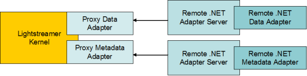

# Lightstreamer - "Hello World" Tutorial - .NET Adapter

<!-- START DESCRIPTION lightstreamer-example-helloworld-adapter-dotnet -->

This project, of the "Hello World with Lightstreamer" series, will focus on a .NET port of the Java Data Adapter illustrated in [Lightstreamer - "Hello World" Tutorial - Java Adapter](https://github.com/Lightstreamer/Lightstreamer-example-HelloWorld-adapter-java). In particular, both a <b>C#</b> version and a <b>Visual Basic</b> version of the Data Adapter will be shown.
<!-- END DESCRIPTION lightstreamer-example-helloworld-adapter-dotnet -->

As an example of [Clients Using This Adapter](https://github.com/Lightstreamer/Lightstreamer-example-HelloWorld-adapter-dotnet#clients-using-this-adapter), you may refer to the ["Hello World" Tutorial - HTML Client](https://github.com/Lightstreamer/Lightstreamer-example-HelloWorld-client-javascript) and view the corresponding [Live Demo](http://demos.lightstreamer.com/HelloWorld/).

## Details

First, please take a look at the previous installment [Lightstreamer - "Hello World" Tutorial - HTML Client](https://github.com/Lightstreamer/Lightstreamer-example-HelloWorld-client-javascript), which provides some background and the general description of the application.
Notice that the front-end will be exactly the same. We created a very simple HTML page that subscribes to the "greetings" Item, using the "HELLOWORLD" Adapter. Now, we will replace the "HELLOWORLD" Adapter implementation based on Java with C# and Visual Basic equivalents.
On the client side, nothing will change, as server-side Adapters can be transparently switched and changed, as long as they respect the same interfaces. Thanks to this decoupling provided by Lightstreamer Server, we could even do something different.
For example, we could keep the Java Adapter on the server side and use Flex, instead of HTML, on the client side. Or, we could use the C# Adapter on the server side and use Java, instead of HMTL or Flex, on the client side. Basically, all the combinations of languages and technologies on the client side and on the server side are supported.

Please refer to [General Concepts](https://www.lightstreamer.com/docs/base/General%20Concepts.pdf) for more details about Lightstreamer Adapters.

### .NET Interfaces

Lightstreamer Server exposes native Java Adapter interfaces. The .NET interfaces are added through the [Lightstreamer Adapter Remoting Infrastructure (**ARI**)](https://lightstreamer.com/api/ls-generic-adapter/latest/ARI%20Protocol.pdf). 

*The Architecture of Adapter Remoting Infrastructure for .NET.*



ARI is simply made up of two Proxy Adapters and a *Network Protocol*. The two Proxy Adapters, one implementing the Data Adapter interface and the other implementing the Metadata Adapter interface, are meant to be plugged into Lightstreamer Kernel.

Basically, the Proxy Data Adapter exposes the Data Adapter interface through TCP sockets. In other words, it offers a Network Protocol, which any remote counterpart can implement to behave as a Lightstreamer Data Adapter. This means you can write a remote Data Adapter in any language, provided that you have access to plain TCP sockets.
But, if your remote Data Adapter is based on certain languages/technologies (such as Java, .NET, and Node.js), you can forget about direct socket programming, and leverage a ready-made library that exposes a higher level interface. Now, you will simply have to implement this higher level interface.<br>
<br>
In this specific example we will leverage the <b>Lightstreamer .NET Standard Adapter API</b> library. So, let's recap... the Proxy Data Adapter converts from a Java interface to TCP sockets, and the .NET Standard library converts from TCP sockets to a .NET interface.
<br>
The full API references for the languages covered in this tutorial are available from [.NET Standard API reference for Adapters](https://lightstreamer.com/api/ls-dotnetstandard-adapter/latest/frames.html?frmname=topic&frmfile=index.html)

### Dig the Code

#### The C# Data Adapter

(Skip this section if you are only interested in [The Visual Basic Data Adapter](https://github.com/Lightstreamer/Lightstreamer-example-HelloWorld-adapter-dotnet#the-visual-basic-data-adapter).)

The C# Data Adapter consists of two classes: the `DataAdapterLauncher` contains the application's <b>Main</b> and initializes the DataProviderServer (the provided piece of code that implements the Network Protocol); the `HelloWorldAdapter` implements the actual Adapter interface.

##### DataAdapterLauncher

The DataAdapterLauncher creates a DataProviderServer instance and assigns a HelloWorldAdapter instance to it. Then, it creates two TCP client sockets, because the Proxy Data Adapter, to which our remote .NET Adapter will connect, needs two connections (but as we said, after creating these sockets, you don't have to bother with reading and writing, as these operations are automatically handled by the DataProviderServer). Let's use TCP ports <b>6661</b> and <b>6662</b>. Assign the stream of the first socket to the RequestStream and ReplyStream properties of the DataProviderServer. Assign the stream of the second socket to the NotifyStream property of the DataProviderServer. Finally, you start the DataProviderServer.

##### HelloWorldAdapter

The HelloWorldAdapter class implements the <b>IDataProvider</b> interface (which is the .NET remote equivalent of the Java DataProvider interface).

Implement the <b>SetListener</b> method to receive a reference to the server's listener that you will use to inject events.

Then, implement the <b>Subscribe</b> method. When the "greetings" item is subscribed to by the first user, the Adapter receives that method call and starts a thread that will generate the real-time data. If more users subscribe to the "greetings" item, the Subscribe method is not called anymore. When the last user unsubscribes from this item, the Adapter is notified through the <b>Unsubscribe</b> call. In this case, we stop the publisher thread for that item. If a new user re-subscribes to "greetings", the Subscribe method is called again. As already mentioned in the previous installment, this approach avoids consuming processing power for items no one is currently interested in.

The <b>Run</b> method is executed within the thread started by Subscribe. Its code is very simple. We create a Hashtable containing a message (alternating "Hello" and "World") and the current timestamp. Then we inject the Hashtable into the server through the listener. We wait for a random time between 1 and 3 seconds, and we are ready to generate a new event.

#### The Visual Basic Data Adapter

Now let's work with Visual Basic instead of C#.

It consists of two modules: the `DataAdapterLauncher`, which contains the application's <b>Main</b> and initializes the DataProviderServer (the provided piece of code that implements the Network Protocol); The `HelloWorldAdapter` that implements the actual Adapter interface.

##### DataAdapterLauncher

The `DataAdapterLauncher.vb` creates a DataProviderServer instance and assigns a HelloWorldAdapter instance (which we will define below) to it. Then, it creates two TCP client sockets, because the Proxy Data Adapter, to which our remote .NET Adapter will connect, needs two connections (but as we said, after creating these sockets, you don't have to bother with reading and writing, as these operations are automatically handled by the DataProviderServer). Let's use TCP ports <b>6661</b> and <b>6662</b>. Assign the stream of the first socket to the RequestStream and ReplyStream properties of the DataProviderServer. Assign the stream of the second socket to the NotifyStream property of the DataProviderServer. Finally, start the DataProviderServer.

##### HelloWorldAdapter

The HelloWorldAdapter class implements the <b>IDataProvider</b> interface (which is the .NET remote equivalent of the Java DataProvider interface).

Implement the <b>SetListener</b> subroutine to receive a reference to the server's listener that you will use to inject events.

Then, implement the <b>Subscribe</b> subroutine. When the "greetings" item is subscribed to by the first user, the Adapter receives that subroutine call and starts a thread that will generate the real-time data. If more users subscribe to the "greetings" item, the Subscribe subroutine is not called anymore. When the last user unsubscribes from this item, the Adapter is notified through the <b>Unsubscribe</B> call. In this case, we stop the publisher thread for that item. If a new user re-subscribes to "greetings", the Subscribe subroutine is called again.

The <b>Run</b> subroutine is executed within the thread started by Subscribe. Its code is very simple. We create a Hashtable containing a message (alternating "Hello" and "World") and the current timestamp. Then we inject the Hashtable into the server through the listener. We wait for a random time between 1 and 3 seconds, and we are ready to generate a new event.

#### The Adapter Set Configuration

For this demo, we just use a Proxy Data Adapter, while instead, as Metadata Adapter, we use the [LiteralBasedProvider](https://github.com/Lightstreamer/Lightstreamer-example-ReusableMetadata-adapter-java), a simple full implementation of a Metadata Adapter, already provided by Lightstreamer server.
This Adapter pair will be referenced by the clients as "**PROXY_HELLOWORLD**".
The `adapters.xml` file looks like:

```xml
<?xml version="1.0"?>
 
<adapters_conf id="PROXY_HELLOWORLD">
 
  <metadata_provider>
    <adapter_class>com.lightstreamer.adapters.metadata.LiteralBasedProvider</adapter_class>
  </metadata_provider>
 
  <data_provider>
    <adapter_class>PROXY_FOR_REMOTE_ADAPTER</adapter_class>
    <classloader>log-enabled</classloader>
    <param name="request_reply_port">6661</param>
    <param name="notify_port">6662</param>
  </data_provider>
 
</adapters_conf>
```

<i>NOTE: not all configuration options of a Proxy Adapter are exposed by the file suggested above.<br>
You can easily expand your configurations using the generic template, `DOCS-SDKs/adapter_remoting_infrastructure/doc/adapter_conf_template/adapters.xml` or `DOCS-SDKs/adapter_remoting_infrastructure/doc/adapter_robust_conf_template/adapters.xml`, as a reference.</i>

## Install
If you want to install a version of this demo in your local Lightstreamer Server, follow these steps:
* Download *Lightstreamer Server* (Lightstreamer Server comes with a free non-expiring demo license for 20 connected users) from [Lightstreamer Download page](https://lightstreamer.com/download/), and install it, as explained in the `GETTING_STARTED.TXT` file in the installation home directory.
* Get the `deploy.zip` file of the [latest release](https://github.com/Lightstreamer/Lightstreamer-example-HelloWorld-adapter-dotnet/releases) and unzip it
* Plug the Proxy Data Adapter into the Server: go to the `Deployment_LS` folder and copy the `ProxyHelloWorld` directory and all of its files to the `adapters` folder of your Lightstreamer Server installation.
* Alternatively, you may plug the **robust** versions of the Proxy Data Adapter: go to the `Deployment_LS(robust)` folder and copy the `ProxyHelloWorld` directory and all of its files into `adapters`. The robust Proxy Data Adapter can handle the case in which a Remote Data Adapter is missing or fails, by suspending the data flow and trying to connect to a new Remote Data Adapter instance. 
* Launch Lightstreamer Server. The Server startup will complete only after a successful connection between the Proxy Adapters and the Remote Adapters.
* Launch the C# Remote .NET Adapter or the Visual Basic Remote .NET Adapter: the `c_sharp\HelloWorld_Remote_Adapter.cmd` or the `visual_basic\ConsoleApp6.exe` files can be found under `Deployment_DotNet_Core` folder.
* Test the Adapter, launching the client listed in [Clients Using This Adapter](https://github.com/Lightstreamer/Lightstreamer-example-HelloWorld-adapter-dotnet#clients-using-this-adapter).
    * To make the ["Hello World" Tutorial - HTML Client](https://github.com/Lightstreamer/Lightstreamer-example-HelloWorld-client-javascript) front-end pages get data from the newly installed Adapter Set, you need to modify the front-end pages and set the required Adapter Set name to PROXY_HELLOWORLD when creating the LightstreamerClient instance. So edit the `index.htm` page of the Hello World front-end deployed under `Lightstreamer/pages/HelloWorld` and replace:<BR/>
`var client = new LightstreamerClient(null," HELLOWORLD");`<BR/>
with:<BR/>
`var client = new LightstreamerClient(null,"PROXY_HELLOWORLD");;`<BR/>
    * Open a browser window and go to: [http://localhost:8080/HelloWorld/]()

## Build

### Build The C# Data Adapter

To build your own version of `adapter_csharp.exe`, instead of using the one provided in the `deploy.zip` file from the [Install](https://github.com/Lightstreamer/Lightstreamer-example-HelloWorld-adapter-dotnet#install) section above, follow these steps:
* Download this project.
* Create a new C# project (we used Microsoft's [Visual Studio Community Edition](https://visualstudio.microsoft.com/downloads/)): 
from the "New Project..." wizard, choose the "Visual C#" language and the ".NET Core App Console" template, then use "adapter_csharp" as project name.
* From the "Solution Explorer", delete the default `Program.cs`. 
* Get the binaries files of the Lightstreamer .NET Standard Adapters Server library from NuGet [Lightstreamer.DotNetStandard.Adapters](https://www.nuget.org/packages/Lightstreamer.DotNetStandard.Adapters/), copy it into the `lib` directory and add it as a reference for the project; or more simply, use directly the "NuGet Package Manager" looking for 'Lightstreamer Adapters' and intalling the Lightstreamer.DotNetStandard.Adapters package.
* Add the `DataAdapterLauncher.cs` and the `HelloWorld.cs` files from the "Add -> Existing Item" dialog. 
* From the Build menu, choose "Build Solution".

### Build The Visual Basic Data Adapter
To build your own version of `adapter_vb.exe`, instead of using the one provided in the `deploy.zip` file from the [Install](https://github.com/Lightstreamer/Lightstreamer-example-HelloWorld-adapter-dotnet#install) section above, follow these steps:
* Download this project.
* Create a new VB project (we used Microsoft's [Visual Studio Community Edition](https://visualstudio.microsoft.com/downloads/)):
from the "New Project..." wizard, choose the "Visual Basic" language and the "Console Application" template, then use "adapter_vb" as project name.
* From the "Solution Explorer", delete the default Module1.vb.
* Get the binaries files of the Lightstreamer .NET Standard Adapters Server library from NuGet [Lightstreamer.DotNetStandard.Adapters](https://www.nuget.org/packages/Lightstreamer.DotNetStandard.Adapters/), copy it into the `lib` directory and add it as a reference for the project; or more simply, use directly the "NuGet Package Manager" looking for 'Lightstreamer Adapters' and intalling the Lightstreamer.DotNetStandard.Adapters package.
* Add the `DataAdapterLauncher.vb` and the `HelloWorld.vb` module to the project from the "Add -> Exixting Item" dialog.
* From the Build menu, choose "Build Solution".

## See Also 

* [Adapter Remoting Infrastructure Network Protocol Specification](https://lightstreamer.com/api/ls-generic-adapter/latest/ARI%20Protocol.pdf)
* [.NET Adapter API Reference](https://lightstreamer.com/api/ls-dotnetstandard-adapter/latest/index.html)
 
### Clients Using This Adapter
<!-- START RELATED_ENTRIES -->
* [Lightstreamer - "Hello World" Tutorial - HTML Client](https://github.com/Lightstreamer/Lightstreamer-example-HelloWorld-client-javascript)

<!-- END RELATED_ENTRIES -->

### Related Projects

* [Complete list of "Hello World" Adapter implementations with other technologies](https://github.com/Lightstreamer?utf8=%E2%9C%93&q=Lightstreamer-example-HelloWorld-adapter&type=&language=)
* [Lightstreamer - Reusable Metadata Adapters - Java Adapter](https://github.com/Lightstreamer/Lightstreamer-example-ReusableMetadata-adapter-java)

## Lightstreamer Compatibility Notes

* Compatible with Lightstreamer SDK for .NET Standard Adapters since version 1.11.
* For instructions compatible with Lightstreamer SDK for .NET Adapters version 1.10, please refer to [this tag](https://github.com/Lightstreamer/Lightstreamer-example-HelloWorld-adapter-dotnet/tree/current_1.10).

## Final Notes
For more information, please [visit our website](http://www.lightstreamer.com/) and [post to our support forums](http://forums.lightstreamer.com) any feedback or question you might have. Thanks!
